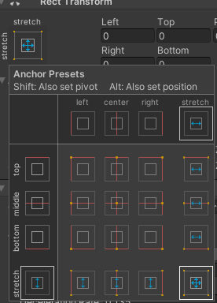
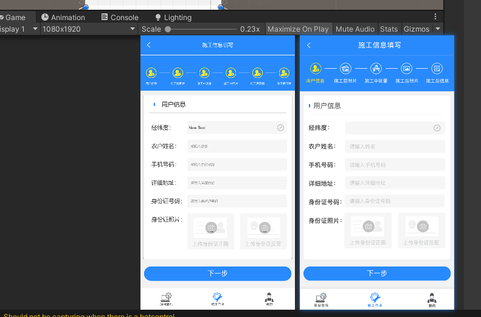

# UGUI使用

1. Rect Transform 里的锚点设置，除了直接点击设置锚点为，按住Alt可以同时快速设置位置，按住Shift可以快速设置中心点  

2. 三种layout：HorizonLayout、VerticalLayout、GridLayout，可以快速进行规则布局  

3. 先划分区域在进行区域内UI制作，除了不容易出错外还可以在之后改动时快速修改

4. 规则的部分使用预制体，在有修改时可以节省大量时间

5. 使用Snipaste这样的贴图工具可以快速将原型图片与正在制作的ui进行比较，可以快速找准比例，填写文字，获取颜色  

6. 命名规范:每个人或者团体都有自己的规范，能够辨识即可，我的规范是将需要脚本操作的最小对象使用“[组件简称]_[名称]”这个的名字，如"btn_quit"、"img_backGround"，规则多个对象的父物体用“XXX Group”，如"Button Group"，其他对象随意命名，能表示其意义即可

7. Image组件当你选中一张图片后，会出现Set Natice Size按钮，可以还原美工设计的尺寸  

