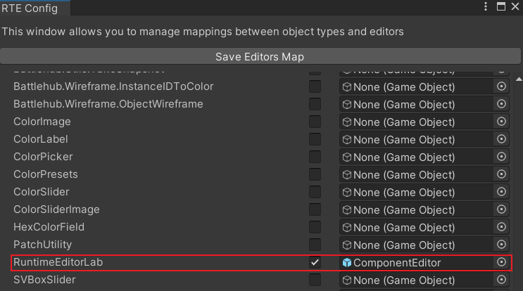
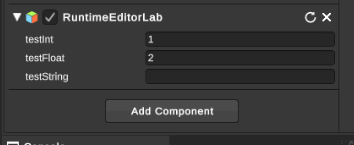

# 在RuntimeEditor中新增自定义脚本

环境：windows10系统，unity2020.3.18f1c1 personal，RuntimeEditor插件3.5版本

## 编写自定义脚本以及配置类  

* 编写在RuntimeEditor(简称RTEditor)中使用的自定义脚本和普通脚本基本相同，都必须继承MonoBehaviour类，RTEditor中有一些类似于Awake、Start之类的自动调用方法，[具体方法链接](https://rteditor.battlehub.net/manual/infrastructure.html#event-methods)。  

* 为了能够在RTEditor中配置脚本的序列化字段，需要额外编写一个脚本对展示字段进行配置，需要注意的是，原本的类字段应全部使用public而不能使用private且有[SerializeField]属性的字段，因为会导致配置类无法获取到字段。   

* 配置类需要继承抽象类ComponentDescriptorBase\<TComponent\>，其中TComponent泛型应当填入需要配置的类，此抽象类只有一个抽象方法GetProperties，用于在RTEditor中在需要时返回需要序列化显示的字段数组。返回的数组类型为PropertyDescriptor[]，构造一个PropertyDescriptor对象需要传入三个值，分别是便签名称、编辑的组件数组、序列化字段的反射信息，其中编辑的组件数组在没有特殊需求的情况下直接使用抽象方法传入的数据即可，序列化字段的反射信息可以通过RTEditor自己的工具方法获取。  

* 例子(省略了using)：
``` C# 

public class RuntimeEditorLab : MonoBehaviour
{
    public int testInt;
    public float testFloat;
    public string testString;

}

public class RuntimeEditorLabComponentDescriptor : ComponentDescriptorBase<RuntimeEditorLab>
{
    public override PropertyDescriptor[] GetProperties(ComponentEditor editor, object converter)
    {
        MemberInfo testInt = Strong.MemberInfo((RuntimeEditorLab x) => x.testInt);
        MemberInfo testFloat = Strong.MemberInfo((RuntimeEditorLab x) => x.testFloat);
        MemberInfo testString = Strong.MemberInfo((RuntimeEditorLab x) => x.testString);

        return new[]
        {
                new PropertyDescriptor("testInt", editor.Components, testInt),
                new PropertyDescriptor("testFloat", editor.Components, testFloat),
                new PropertyDescriptor("testString", editor.Components, testString),
        };
    }
}
```  

## 配置脚本使其可以配置

* 首先打开RTEditor的编辑器配置  

  

* 随后在ScriptEditors分类中找到并选择自定义脚本，右侧的GameObject没有特殊需求时选择Battlehub\RTEditor\Content\Runtime\RTEditor\Prefabs\Editors\ComponentEditor.prefab即可。



* 随后点击Save Editors Map按钮保存配置即可。  
此时就可以添加刚才编写的自定义脚本并编辑序列化字段了。

  

* 但此时若保存RTEditor中的场景然后再加载，会发现添加的自定义脚本并不会保存，这是因为RTEditor不会在保存场景时对新增的自定义脚本进行序列化保存，需要在SaveLoad中进行配置。

## 配置脚本的序列化保存  

* 首先需要开启Runtiem SaveLoad的持久存储类配置

  

* 找到并勾选自定义脚本及其想要持久存储的字段

  

* 随后点击BuildAll完成配置即可。  
之后在RTEditor保存场景时，就可以保存编写的自定义脚本了。  
